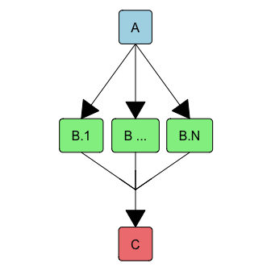

IDTaxa training sets from NCBI COGs
================
Nicholas P. Cooley, Department of Biomedical Informatics, University of
Pittsburgh
2024-11-30

# Building training sets for IDTaxa

Annotation by definition relies on some knowledge base of training data.
This repo contains a relatively uncomplicated scheme for creating
training sets for the annotation tool IDTaxa. The code within relies on
HTCondor, and is written to run smoothly on the open science grid, but
is also general enough that a reasonable user should be able to use it
as a starting point for a variety of tasks.

There isn’t any magic to this process, a short DAG controls the entire
process wherein a single node goes out to the NCBI and grabs a few files
to facilitate planning. A flight of nodes are planned to grab data for
available COGs, and once that data is collected, it is all brought
together and munged into a few different training sets.

<div class="figure" style="text-align: center">


<p class="caption">
Conceptual DAG structure
</p>

</div>

In HTCondor’s language, this dag simply looks like:

``` bash
# Overall manager!

# we need to collect:
# the COG list
# the tax dump

# A is pretty simple, just trigger a job with pre and post scripts
JOB A Plan/Plan.sub

# Within the B subdag pre and post scripts manage success and planning of a 
# 'Run.dag' dag that triggers the actual jobs, so they live within the subdag,
# as opposed to within the manager dag
SUBDAG EXTERNAL B Collection/Collection.dag

# this node is currently left blank because how we merge COGs and taxonomies to
# form training sets is going to depend a lot on the shape of the data that we collect
SUBDAG EXTERNAL C Training/Training.dag

PARENT A CHILD B
PARENT B CHILD C

RETRY B 3
RETRY C 3

SCRIPT PRE A Plan/PrePlanning.sh
SCRIPT POST A Plan/PostPlanning.sh
# this script exists solely to nuke the dag files that get generated so that we
# keep the directory managable
# SCRIPT POST B PostCollection.sh
# tbd once the C node is fully fleshed out
# SCRIPT POST C PostTraining.sh
```

The actual `Manager.dag` file is present in this repo along with the
rest of the files related to running this workflow.

## Manager

A single manager DAG controls planning, data collection, and training.
In this case because planning is relatively simple, the planning job is
just a regular condor job. While both the training and collection steps
are subdags.

### Planning

There are relatively well defined NCBI products that we can pull to plan
this job. We can pull the taxdump and list of COGs directly from their
respective homes on NCBI’s FTP site.

### Collection

A fairly straightforward subDAG is used to plan and run data collection,
and check for completeness of the collection step. The collection subDAG
itself triggers a `Run.dag` subDAG that is built and rebuild on the fly
depending on whether or not this step needs to re-run to make multiple
attempts at failed jobs. This structure is useful for both complications
that can occur with either the nodes themselves (difficulties talking to
the NCBI) or with condor (usually data transfer, but sometimes container
management).

### Training

Currently under construction as the genres and types of training sets we
want to construct will be determined by the structure of the COG data
collected.

# Reproducibility

The training sets generated here will be available on zenodo (coming
soon!).
